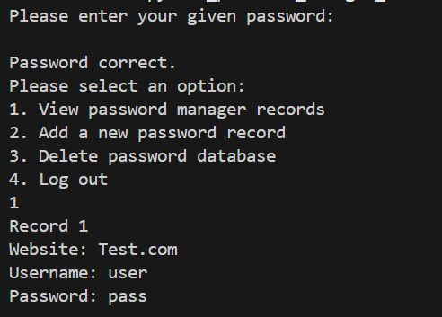

# Python Password Manager
A local python password manager which incorporates encryption.

# Program screenshots

The program makes use of a text based input for the user to interact with.

# Instructions
After setting a master password, the user can complete the actions outlined by the program. If the user wishes to delete all records they can simply delete the database.db file that was created.
